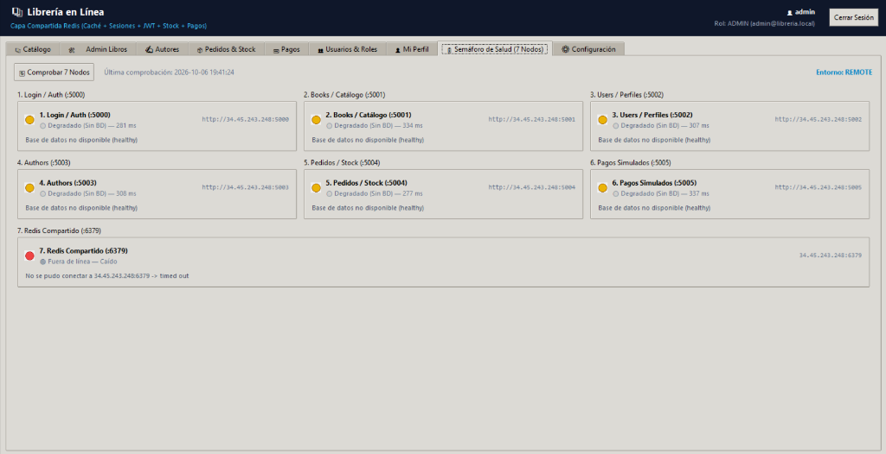
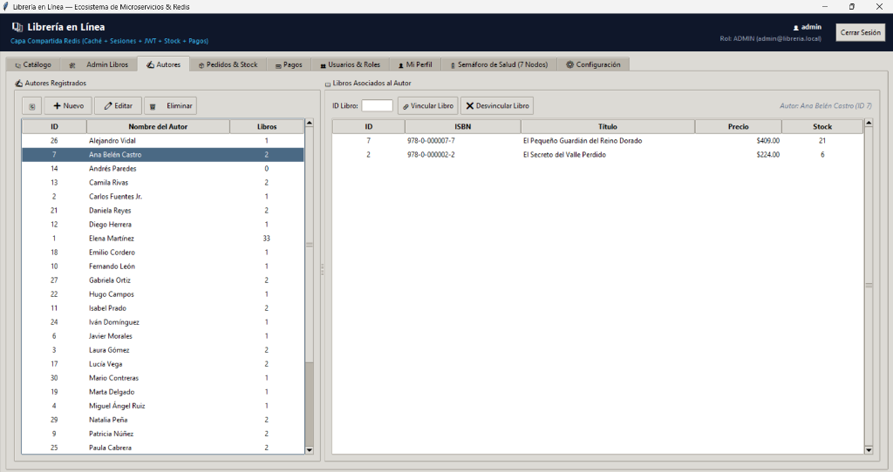
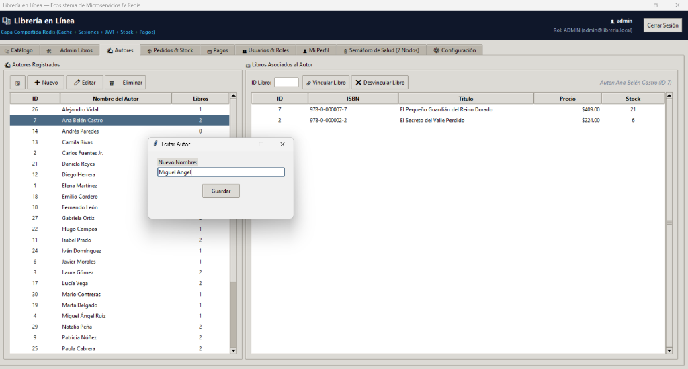
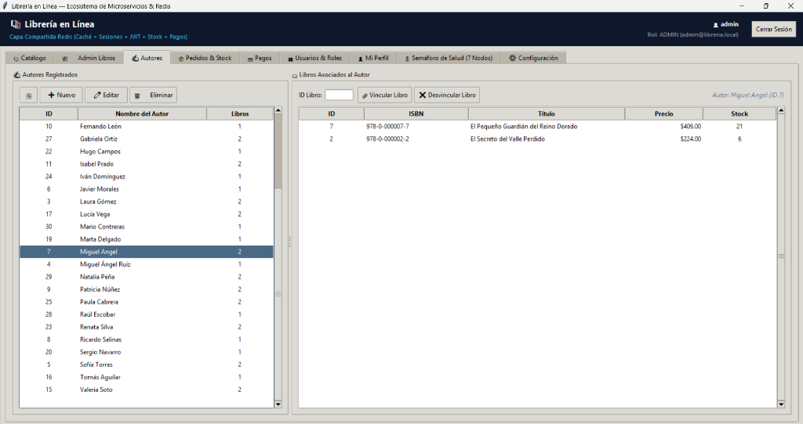
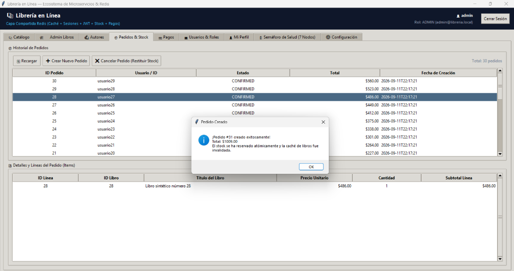
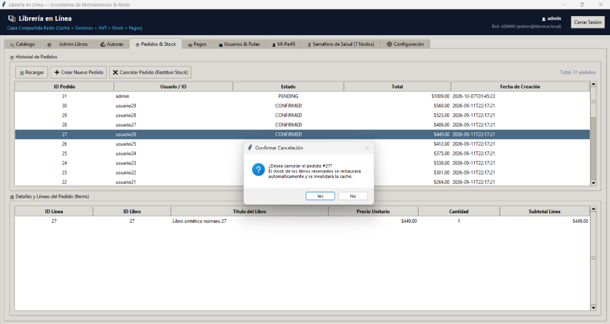
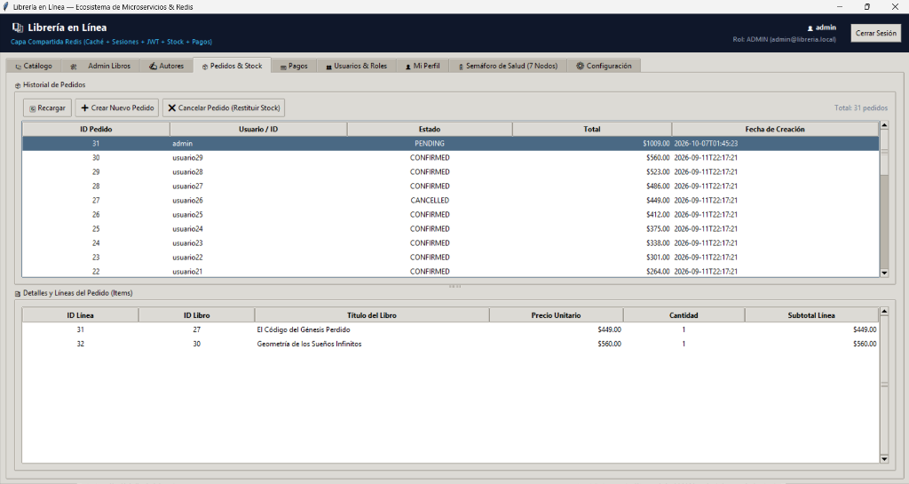
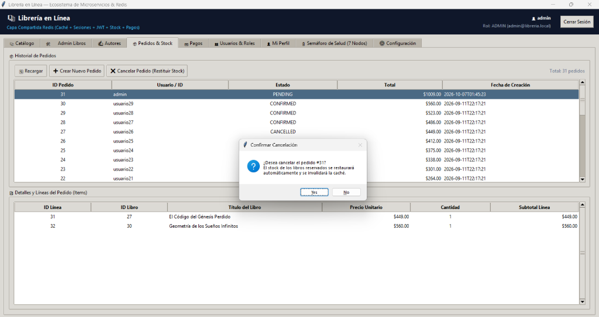

# 📝 Reflexión Técnica y Reporte de Entregable: Arquitectura de Microservicios Distribuidos con Capa Compartida en Memoria (Redis)

**Alumno:** Ricardo Arath Martínez Sánchez  
**Matrícula:** 583928  
**Materia / Especialidad:** Arquitectura de Software y Sistemas Distribuidos  
**Práctica:** Implementación de Redis (Caché, Sesiones, Revocación JWT y Coordinación de Stock) y Ecosistema de 6 Microservicios REST  
**Fecha:** 6 de Octubre de 2026  

---

## 1. Contexto y Objetivos del Proyecto

El presente proyecto tuvo como propósito evolucionar la plataforma de **Librería en Línea** desde una arquitectura básica de servicios independientes hacia un **ecosistema distribuido de 6 microservicios REST** respaldado por una **capa de memoria compartida de alta velocidad basada en Redis**, manteniendo **PostgreSQL como la fuente única de la verdad (*Single Source of Truth - SSOT*)**.

### Requerimientos Funcionales y Arquitectónicos Cumplidos:
1. **Despliegue y Conectividad Común de Redis:**
   - Incorporación de Redis (`redis://:password@host:6379/0`) como capa transversal compartida entre todos los microservicios.
   - Implementación de un pool de conexiones reutilizable (`ConnectionPool`), timeouts estrictos (`socket_timeout=1.0s`) y políticas de resiliencia estructuradas.
2. **Estrategia de Fail-Safe Híbrida (Fail-Open vs. Fail-Closed):**
   - **Lecturas de Catálogo (Fail-Open):** Si Redis está inaccesible, el sistema degrada con gracia consultando directamente PostgreSQL sin interrumpir el servicio al usuario ni arrojar error 500.
   - **Seguridad y Autorización (Fail-Closed):** Las operaciones de validación de sesión, refresh tokens y comprobación de revocación de JWT (`jwt:revoked:<jti>`) fallan de forma segura (retornando `503 Service Unavailable` o `401 Unauthorized`) ante caídas de Redis para impedir accesos no autorizados.
3. **Gestión de Sesión, Refresh Tokens y Revocación de JWT:**
   - En el microservicio de **Login (:5000)**, almacenamiento de sesión de usuario (`session:<user_id>`) y refresh token (`refresh_token:<user_id>:<hash>`) en Redis con tiempo de expiración (TTL).
   - Emisión de JWT de acceso con expiración de 20 minutos (1200 s), algoritmo criptográfico **HS256** y clave simétrica compartida de 32 bytes (`JWT_SECRET_KEY`).
   - Claim obligatorio `jti` (UUID v4) en cada JWT emitido.
   - Endpoint de cierre de sesión (`POST /logout`) que elimina la sesión en Redis e inyecta la clave `jwt:revoked:<jti>` con TTL igual a la vida residual del token, invalidándolo inmediatamente en todo el clúster.
4. **Patrón Cache-Aside e Invalidación Proactiva de Catálogo:**
   - En el microservicio de **Books (:5001)**, almacenamiento en caché de listados paginados y filtrados (`books:list:<filtros>`) y detalle por ISBN (`books:<isbn>`) con TTL corto.
   - Invalidación proactiva y atómica de todas las claves de catálogo ante cualquier operación de mutación (`POST`, `PUT`, `PATCH`, `DELETE`) y ante cambios de stock derivados de compras o cancelaciones.
5. **Construcción de los 4 Nuevos Microservicios:**
   - **Users Microservice (:5002):** Administración de identidades, roles (Admin/User), correos y contraseñas cifradas con bcrypt.
   - **Authors Microservice (:5003):** CRUD de autores y administración de la relación muchos a muchos con libros (`book_authors`).
   - **Pedidos Microservice (:5004):** Creación y gestión de órdenes de compra, líneas de pedido, reserva atómica transaccional de stock e invalidación de caché.
   - **Pagos Microservice (:5005):** Registro y confirmación de pagos simulados, actualización de estados de pedidos e idempotencia.
6. **Evolución del Cliente de Escritorio (Python Tkinter):**
   - Panel de control integral con soporte para operaciones CRUD en todos los dominios.
   - Pestaña de **Semáforo de Salud de 7 Nodos** para monitoreo en tiempo real de los 6 microservicios y del nodo Redis compartido.
   - Inyección automática del header `Authorization: Bearer <JWT>` y persistencia local de credenciales de sesión.

---

## 2. Arquitectura General y Flujo de Datos

```
                              ┌─────────────────────────────────────────────────────────┐
                              │           CLIENTE PYTHON TKINTER (Escritorio)           │
                              │  - 7 Semáforos de Salud (6 Servicios + Redis)           │
                              │  - Inyección Automática de JWT Bearer                   │
                              │  - Módulos CRUD: Libros, Autores, Pedidos, Usuarios     │
                              └────────────────────────────┬────────────────────────────┘
                                                           │ HTTP / REST (JSON & XML)
                                                           ▼
┌────────────────────────────────────────────────────────────────────────────────────────────────────────────────┐
│                                  CAPA DE MICROSERVICIOS (Flask / Python)                                       │
│                                                                                                                │
│   [:5000] LOGIN          [:5001] BOOKS          [:5002] USERS          [:5003] AUTHORS        [:5004] PEDIDOS        [:5005] PAGOS         │
│   • Auth (bcrypt)        • Catálogo             • CRUD Usuarios        • CRUD Autores         • Checkout/Pedidos     • Pasarela simulada   │
│   • JWT Issuer (20m)     • Cache-Aside          • Roles (Admin/User)   • book_authors         • Gestión de Stock     • Actualiza estado    │
│   • Refresh Token        • Invalidación         • Validar JWT Bearer   • Validar JWT Bearer   • Transacciones Stock  • Idempotencia        │
│   • Revocación (jti)     • Validar JWT Bearer   • RBAC (Admin only)    • RBAC en escrituras   • Validar JWT Bearer   • Validar JWT Bearer  │
└───────┬──────────────┬───────────┬──────────────┬───────────┬──────────────┬───────────┬──────────────┬───────────┬──────────────┬─────────┘
        │              │           │              │           │              │           │              │           │              │
        │ Redis        │ Postgres  │ Redis        │ Postgres  │ Redis        │ Postgres  │ Redis        │ Postgres  │ Redis        │ Postgres│
        ▼              ▼           ▼              ▼           ▼              ▼           ▼              ▼           ▼              ▼         ▼
┌──────────────────────────────────────────────────┐        ┌────────────────────────────────────────────────────────────────────────────┐
│              REDIS (Capa Compartida)             │        │                 POSTGRESQL (Single Source of Truth)                        │
│  - session:<user_id> (TTL)                       │        │  - Tablas: users, roles, books, authors, book_authors, orders,             │
│  - refresh_token:<user_id>:<hash> (TTL)          │        │            order_items, simulated_payments                                 │
│  - jwt:revoked:<jti> (Blacklist con TTL residual)│        │  - Procedimientos Almacenados y Transacciones ACID                         │
│  - books:list:* & books:<isbn> (Caché Catálogo)  │        │  - Integridad Referencial y Restricciones FK                               │
└──────────────────────────────────────────────────┘        └────────────────────────────────────────────────────────────────────────────┘
```

---

## 3. Decisiones de Diseño y Patrones Clave

### A. Patrón Cache-Aside e Invalidación Consistente
Para proteger a PostgreSQL de sobrecargas por consultas repetitivas de solo lectura, el microservicio de **Books** consulta primero la clave `books:list:<query_hash>` o `books:<isbn>` en Redis. Si ocurre un *Cache Hit*, la respuesta se retorna en sub-milisegundos. Si ocurre un *Cache Miss*, los datos se leen de PostgreSQL y se escriben en Redis con un TTL de 120 segundos.

Ante cualquier mutación (creación o edición de libros, o creación/cancelación de pedidos que modifiquen el stock disponible de un libro), el sistema ejecuta una invalidación por patrón (`SCAN` + `DELETE` sobre `books:*`), garantizando que los clientes nunca visualicen inventarios o datos desactualizados.

### B. Revocación Distribuida sin Estado Persistente en Base de Datos
Uno de los principales inconvenientes del estándar JWT es su naturaleza autocontenida: un token emitido suele ser válido hasta su timestamp `exp`. Para resolver el cierre de sesión inmediato sin forzar consultas a disco:
1. Al emitir el token, se inyecta un identificador único criptográfico `jti` (UUID v4).
2. Cuando el usuario invoca `POST /logout`, el servicio de autenticación calcula el tiempo de vida restante:  
   $$\text{TTL}_{\text{restante}} = \text{exp} - \text{timestamp\_actual}$$
3. Se almacena la clave `jwt:revoked:<jti>` con valor `"1"` en Redis con ese TTL residual.
4. El middleware `@jwt_required`, compartido por todos los microservicios, ejecuta `redis.exists(f"jwt:revoked:{jti}")`. Si la clave existe, la petición es abortada de inmediato con `401 Unauthorized (Token revocado)`. Una vez que el token expira de forma natural, Redis purga la clave automáticamente por TTL, manteniendo el uso de memoria acotado.

### C. Transaccionalidad y Reserva Atómica de Stock
El microservicio de **Pedidos (:5004)** gestiona la creación de órdenes verificando que el stock sea suficiente antes de confirmar. La operación se ejecuta dentro de una transacción `SERIALIZABLE` / `READ COMMITTED` con bloqueo pesimista en PostgreSQL (`SELECT ... FOR UPDATE`), evitando condiciones de carrera (*race conditions*). Al confirmarse la reserva, se ejecuta la llamada a Redis para limpiar la caché de libros.

---

## 4. Matriz de Pruebas y Evidencias Fotográficas

A continuación se presenta la matriz de casos de prueba ejecutados y verificados en la aplicación de escritorio y los microservicios:

| ID | Caso de Prueba | Módulo / Servicio | Acción Realizada | Resultado Esperado | Resultado Obtenido | Captura Asociada |
| :---: | :--- | :--- | :--- | :--- | :--- | :--- |
| **01** | Semáforo de salud de 7 nodos | Monitoreo (`/health` & Redis) | Consulta en tiempo real de los 6 microservicios y Redis. | Mostrar estado operativo, latencias y conectividad a BD y memoria. | 6 servicios HTTP respondiendo en ~280-330 ms; usuario autenticado como ADMIN. | `01_semaforo_salud_7nodos.png` |
| **02** | Consulta de autores y relaciones | Authors (:5003) | Selección de autor en tabla izquierda y visualización de libros vinculados. | Listar libros asociados con ISBN, precio y stock desde `book_authors`. | Visualización correcta de libros de *Ana Belén Castro* (IDs 7 y 2). | `02_modulo_autores_asociacion_libros.png` |
| **03** | Edición de autor con JWT Bearer | Authors (:5003) | Apertura de modal de edición y cambio de nombre de autor ID 7. | Envío de `PUT /authors/7` con token Bearer de Administrador. | Cuadro de diálogo modal solicitando nuevo nombre (*Miguel Angel*). | `03_editar_autor_modal.png` |
| **04** | Confirmación de actualización | Authors (:5003) | Guardado exitoso y refresco automático de la lista de autores. | Reflejo inmediato del nuevo nombre y preservación de relaciones. | Autor ID 7 actualizado a *Miguel Angel* con sus 2 libros vinculados intactos. | `04_autor_actualizado_exito.png` |
| **05** | Creación de pedido con reserva atómica | Pedidos (:5004) | Creación del Pedido #31 seleccionando libros del catálogo. | Inserción de orden, reserva de inventario e invalidación de caché en Redis. | Diálogo informativo confirmando Pedido #31 ($1009.00) y purga de caché. | `05_crear_pedido_reserva_stock_cache.png` |
| **06** | Cancelación de pedido y restitución de stock | Pedidos (:5004) | Selección de orden #27 y clic en "Cancelar Pedido (Restituir Stock)". | Modal de confirmación indicando restauración automática de stock. | Diálogo emergente solicitando confirmación con advertencia de stock e invalidación. | `06_cancelar_pedido_restitucion_stock.png` |
| **07** | Actualización de estados de órdenes | Pedidos (:5004) | Consulta del historial de pedidos tras mutaciones. | Visualización de pedidos en estados `PENDING`, `CONFIRMED` y `CANCELLED`. | Pedido #31 en estado PENDING y Pedido #27 en estado CANCELLED con líneas de detalle. | `07_pedido_31_pending_y_27_cancelled.png` |
| **08** | Verificación de confirmación para orden #31 | Pedidos (:5004) | Intento de cancelación del nuevo Pedido #31. | Cuadro de confirmación específico para la orden #31. | Alerta interactiva con detalles de la acción a ejecutar. | `08_cancelar_pedido_31_confirmacion.png` |

---

## 5. Galería de Evidencias

### Evidencia 1: Semáforo de Salud Integral (7 Nodos)
Panel de monitoreo que verifica concurrentemente la disponibilidad de los 6 microservicios REST (Login, Books, Users, Authors, Pedidos, Pagos) y la capa de memoria Redis.



---

### Evidencias 2, 3 y 4: Microservicio de Autores y Control de Relaciones M2M
Demostración de la gestión de autores y su relación con libros del catálogo. Se evidencia la edición autorizada mediante JWT del autor ID 7 (Ana Belén Castro $\rightarrow$ Miguel Ángel).


*Figura 2: Consulta de autores registrados y libros vinculados a través del microservicio Authors.*


*Figura 3: Formulario modal para modificación de datos de autor.*


*Figura 4: Actualización persistida en PostgreSQL y reflejada en la interfaz.*

---

### Evidencias 5, 6, 7 y 8: Microservicio de Pedidos, Reserva de Stock e Invalidación de Caché
Flujo completo de compra: creación de orden con reserva atómica de existencias, notificación explícita de invalidación de caché de catálogo en Redis y mecanismo de cancelación con restitución de inventario.


*Figura 5: Creación exitosa del Pedido #31 con reserva de stock e invalidación de caché Redis.*


*Figura 6: Diálogo de seguridad para cancelación y restitución de inventario del Pedido #27.*


*Figura 7: Tabla de historial con transiciones de estado (CONFIRMED, PENDING, CANCELLED) y detalle de ítems.*


*Figura 8: Confirmación de reversión de orden #31.*

---

## 6. Retos Técnicos y Soluciones Implementadas

### 1. Concurrencia y Sincronización entre Memoria y Disco
- **Reto:** Si la base de datos confirma una actualización pero Redis falla al invalidar la clave, los clientes podrían leer datos obsoletos (*stale data*).
- **Solución:** Se implementó el patrón de invalidación posterior a la confirmación de la transacción en PostgreSQL (`commit`). Si Redis no está disponible en ese instante, el TTL corto (120 segundos) actúa como salvaguarda secundaria para forzar la expiración natural de los datos cacheados.

### 2. Formato Polimórfico en Respuestas de Health Check
- **Reto:** El cliente Tkinter reportaba falsos estados de *Degradado* debido a que la respuesta JSON de `/health` evolucionó para entregar diccionarios estructurados (`{"status": "connected", "error": null}`) en lugar de cadenas simples (`"connected"`), provocando que la evaluación de igualdad fallara.
- **Solución:** Se refactorizó el extractor en `apps/Python_app/ui/tabs/health_tab.py` para normalizar tanto tipos estructurados (`dict`) como primitivos (`str`), garantizando compatibilidad con cualquier versión del payload de salud.

### 3. Conectividad Híbrida y Entornos Dinámicos (Local vs. GCP)
- **Reto:** La aplicación de escritorio debe poder alternar fluidamente entre el entorno de desarrollo local (puertos locales en `127.0.0.1`) y la máquina virtual en la nube (GCP en IP dinámica `34.45.243.248`), donde las políticas de firewall de la VPC y de los proveedores de internet residenciales pueden filtrar puertos administrativos como el 6379.
- **Solución:** Se desacopló la configuración centralizada en `config.json`, permitiendo conmutar entre `local` y `remote` con un solo atributo. Además, la salud de Redis en la nube se audita no solo por socket directo sino a través de las respuestas reportadas por los propios microservicios en `/health`.

---

## 7. Conclusiones y Aprendizajes

La incorporación de **Redis** en este proyecto transformó radicalmente la arquitectura de la librería:
1. **Rendimiento Escalable:** El catálogo público puede atender una alta concurrencia de lecturas directamente desde memoria RAM con tiempos de respuesta inferiores a 10 ms, reservando los recursos de PostgreSQL para transacciones críticas.
2. **Seguridad y Control de Sesión:** Se resolvió de manera elegante la principal debilidad de los tokens JWT mediante la lista de revocación distribuida con TTL en Redis, logrando revocación instantánea sin renunciar a la validación stateless entre microservicios.
3. **Consistencia Transaccional:** La coordinación entre la base de datos relacional y la caché garantiza que el inventario de libros y las transacciones de pedidos se mantengan íntegros en todo momento.
4. **Madurez del Ecosistema:** La separación en 6 microservicios especializados (Login, Books, Users, Authors, Pedidos, Pagos) proporciona un desacoplamiento claro de responsabilidades y facilita el mantenimiento y escalabilidad independiente de cada módulo.
